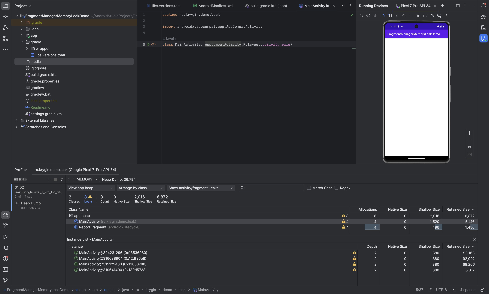
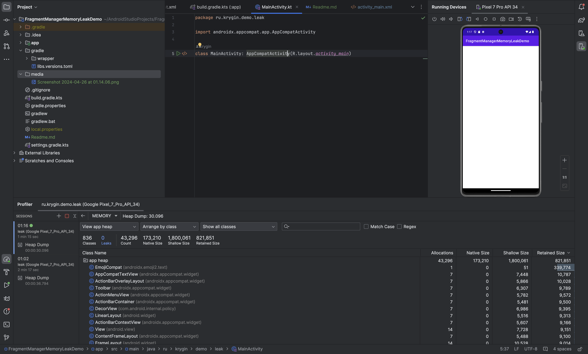

# Memory leak in webview

## The simplest application

### Layout
```xml
<WebView xmlns:android="http://schemas.android.com/apk/res/android"
    android:id="@+id/webView"
    android:layout_width="match_parent"
    android:layout_height="match_parent">
</WebView>
```

### Activity
```kotlin
class MainActivity: AppCompatActivity(R.layout.activity_main)
```

### Android Manifest

```xml

<manifest xmlns:android="http://schemas.android.com/apk/res/android">

    <application>

        <activity android:name=".MainActivity" android:exported="true">
            <intent-filter>
                <category android:name="android.intent.category.LAUNCHER" />
                <action android:name="android.intent.action.MAIN" />
            </intent-filter>
        </activity>

    </application>

</manifest>
```

## Scenario 1
1. Launch application
2. Start profiler
3. Rotate device several times
4. Capture heap dump
5. Explore the report

### Result


## Scenario 2
1. Replace `Webview` with `FrameLayout`
2. Launch application
3. Start profiler
4. Rotate device several times
5. Capture heap dump
6. Explore the report

### Result


